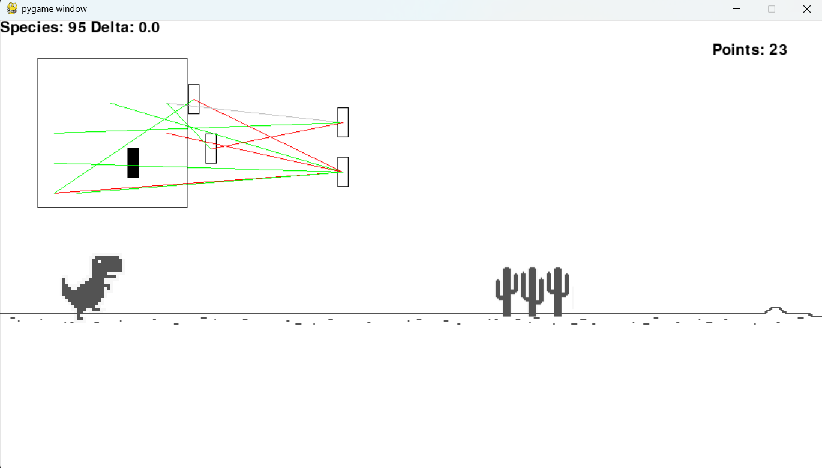

# Very NEAT Dino
Implementation of NEAT algorithm to train an AI to play a classic Chrome Dino browser game.

  

## What is NEAT
NeuroEvolution of Augmenting Topologies (also known as NEAT) is a genetic algorithm for the generation of neural networks. It was proposed in 2002 paper _Evolving Neural Networks through Augmenting Topologies_.

Algorithm alters weights and nodes of networks in search of a structures with high fitness score. Topologies of network start out very simple and, as algorithm progresses, get more and more complex. 

Diversity between genomes in a population of networks is preserved with a special technique called speciation (also described in the paper).

## Description
Program shows NEAT algorithm at work as it passes through generations to find the genome which jumps over every cactus and ducks under every bird.
In the upper left corner is a receptive field - a representation of what a network sees at any given point as well as the neural network itself. Green lines depict positive connections and red lines depict negative connections.

Watch as species number goes up as NEAT attempts to find the right combination of genes. Press any arrow key to speed the game up.

## Requirements
- pygame 2.6.1

## Shoutout
Original pygame code inspired by [maxrohowsky](https://twitter.com/maxrohowsky). Project itself inspired by YouTuber SethBling. Link to video: [link](https://www.youtube.com/watch?v=qv6UVOQ0F44)